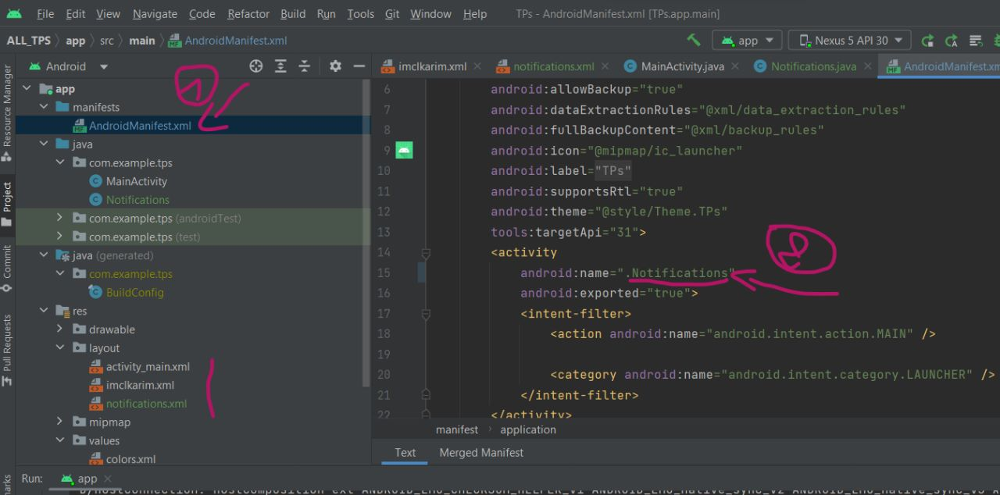
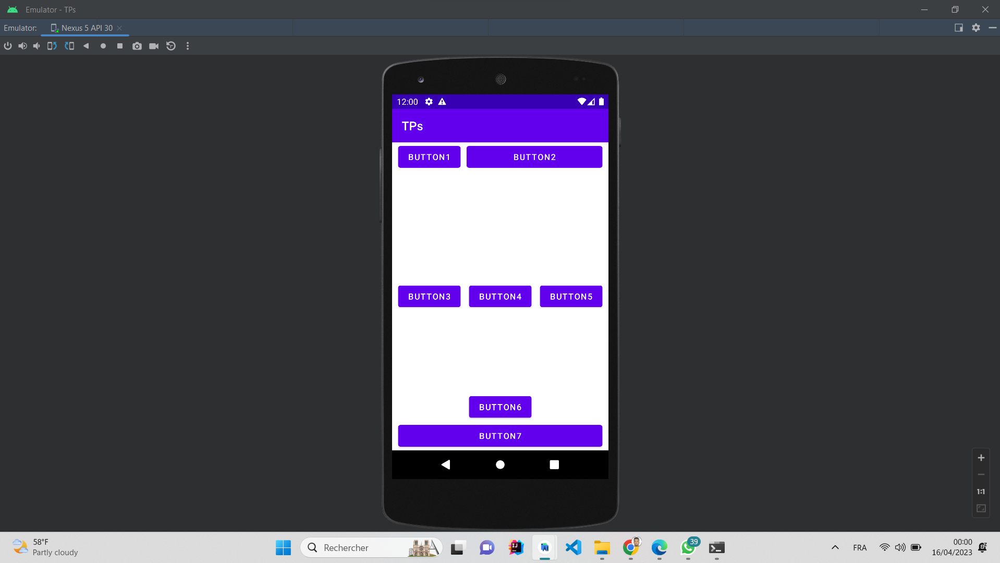
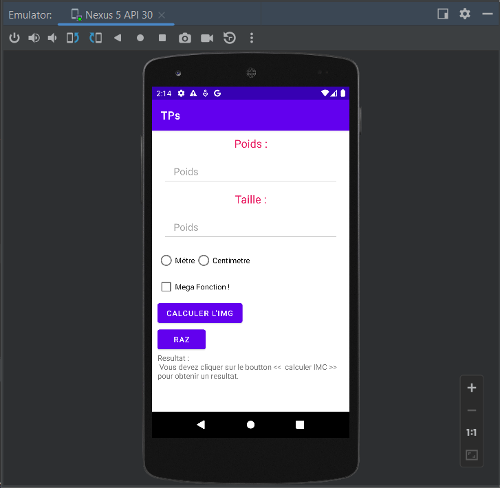
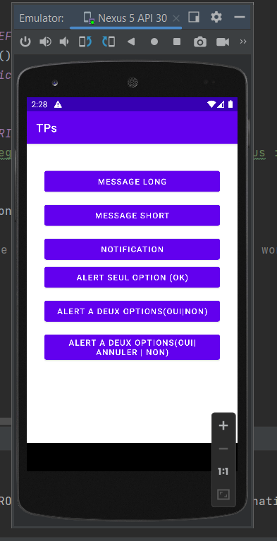

<h1>All TPs( excercices) That we make in our school</h1>

How to navigate between all TPs , just go to app/manifest/AndroidManifest.xml , and change name attribute with the layout name

<h2>TP1:</h2>

<h3> All Buttons inside <i > RelativeLayout </i></h3>

All buttons contains  

<ul>
    <li>android:layout_width="match_parent"</li>
    <li>android:layout_height="wrap_content"</li>
</ul>

<h4>First Button : </h4>
<ul>
    <li>android:layout_alignParentLeft="true"</li>
</ul>

<h4>Second Button : </h4>
<ul>
    
locate btn2 based btn1 position :

    <li>android:layout_toEndOf="@+id/btn1"</li>
    <li>android:layout_toRightOf="@+id/btn1"</li>
    
then :

    <li>android:layout_alignParentRight="true"</li>
    <li>android:layout_marginLeft="10dp"</li>
</ul>

<h4>Third Button : </h4>
<ul>
    <li>android:layout_centerVertical="true"</li>
</ul>

<h4>4th Button : </h4>
<ul>
    <li>android:layout_centerInParent="true"</li>
</ul>

<h4>5th Button : </h4>
<ul>
    <li>android:layout_alignParentRight="true"</li>
    <li>android:layout_centerVertical="true"</li>
</ul>

<h4>6th Button : </h4>
<ul>
    <li>android:layout_above="@+id/btn7"</li>
    <li>android:layout_centerHorizontal="true"</li>
</ul>

<h4>7th Button : </h4>
<ul>
    <li>android:layout_alignParentBottom="true"</li>
</ul>

<h2>TP2: (IMCKARIM)</h2>

Widget used

<ul>
    <li>TextView</li>
    <li>EditText</li>
    <li>RadioGroup - RadioButton</li>
    <li>CheckBox</li>
    <li>Button</li>
</ul>

<h2>TP8 : NOTIFICATIONS</h2>

In this TP we have covered many types of notifications

<ul>
    <li>Message Long</li>
    <li>Message Short</li>
    <li>NOTIFICATION</li>
    <li>ALERT ONE OPTION</li>
    <li>ALERT TWO OPTIONS</li>
    <li>ALERT ONE OPTION with cancel</li>
</ul>

